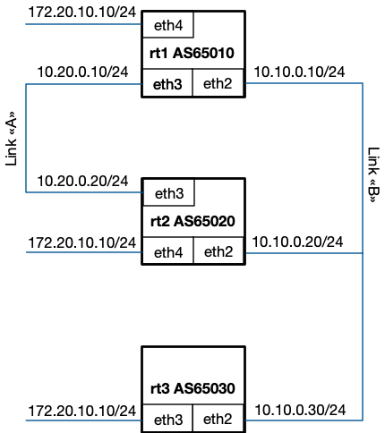
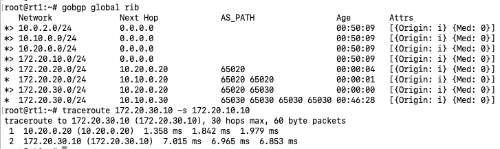
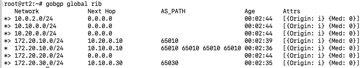
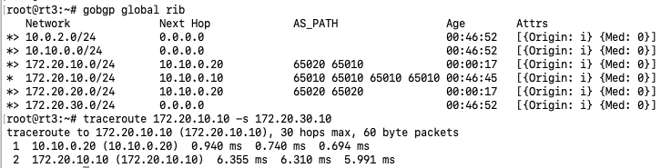

# GoBGP Practical Activity
### Task description
You have the following topology:



GoBGP is installed and peering is configured. Configure BGP policies to ensure that link "A" has higher preference than
link "B" and traffic between ```rt1``` and ```rt3``` passed through ```rt2``` router.
#### 1. Setup Vagrant
Download from https://www.vagrantup.com/downloads.html and install
#### 2. Pull repository
```git clone https://github.com/ivanlysogor/hse-gobgp-bgp```
#### 3. Setup environment
```
cd hse-gobgp-bgp
vagrant up
```
#### 4. Configure virtual routers
Configure virtual routers:
- configure BGP policies to change route priorities

Hints:
- you can connect to you virtual routers with command ```vagrant ssh rt1```
- GoBGP configuration documentation: https://github.com/osrg/gobgp
- GoBGP config file located in /etc folder (/etc/gobgpd.conf)
- GoBGP policy configuration - https://github.com/osrg/gobgp/blob/master/docs/sources/policy.md
- Zebra interface accessible via ```telnet localhost 2601``` with password ```zebra``` and enable ```zebra```

#### 5. Validate
Traceroute rt3 eth3 interface IP address from rt1 eth1 interface to ensure that traffic pass through rt1/rt2 eth4 interfaces.

Test it for opposite direction traffic too.

#### 5. Destroy VM
```vagrant destroy```

#### 6. Solution
Latest commit contains solution
(don't forget `net.ipv4.ip_forward = 1` on rt2 as well)




